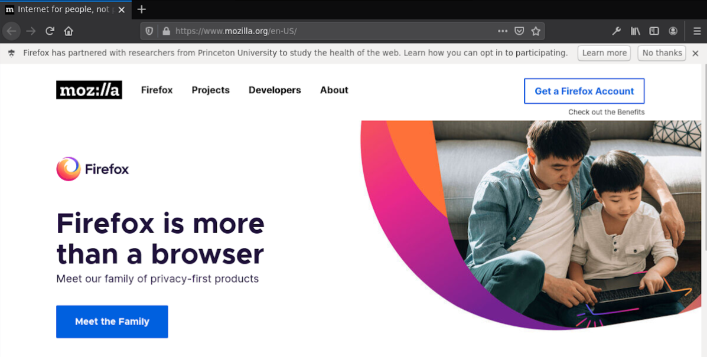

# UX Mockups
This branch provides user experience mockups of how we might request user consent or conduct a survey.
If you want to test the options yourself, note that you'll need to run a [nightly or developer
version of Firefox](https://www.mozilla.org/en-US/firefox/channel/desktop/).

Below are two options for the notification, with sample language for requesting consent.
The language is still preliminary.

### Option 1:
`appendNotification` API:

### Option 2:
`PopupNotifications` API:

