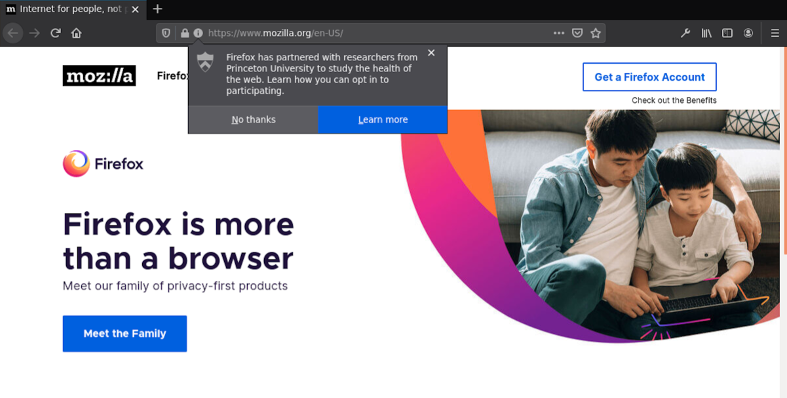

# UX Mockups
This branch provides user experience mockups of how we might request user consent or conduct a survey.
If you want to test the options yourself, note that you'll need to run a [nightly or developer
version of Firefox](https://www.mozilla.org/en-US/firefox/channel/desktop/).

Below are two options for the notification, with sample language for requesting consent.
The language and icons are still preliminary.

### Option 1:
`appendNotification` API:

### Option 2:
`PopupNotifications` API:

## Decisions
### For both consent and surveys
- Which of these two (or other) designs
- Language for the main text
- Language for the buttons (yes, no (and later?))
- Icons
- If using PopupNotifications, which UI element it's anchored to

### For consent
- Where buttons lead (options page? external SUMO page?)
- Process for overall consent vs. per-study consent

### For surveys
- Where buttons lead (directly to survey platform? info page, then platform?)
- Whether surveys are baked-in and scheduled, or can be deployed dynamically

See issue #4 for previous discussion.
